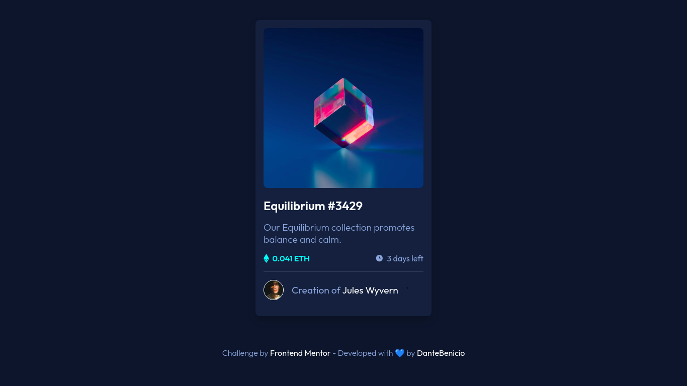

<div align="center">
  <h1>NFT Card</h1>
  
  <br/>
  <br/>

   [](https://nft-card-gold.vercel.app/)
   
  <p>Challenge from <a href="https://www.frontendmentor.io/challenges/nft-preview-card-component-SbdUL_w0U">Frontend Mentor</a> - Developed by <a href="https://github.com/DanteBenicio">DanteBenicio</a>
  <br/>
  <br/>
  
</div>

## 🚀 Run the project

```sh
# Clone the project from Github
git clone https://github.com/DanteBenicio/nft-card

# Access the project folder
cd nft-card

# Install the project dependencies
yarn
or
npm install

# Run the project (port 3000 - http://localhost:3000)
yarn dev
or
npm run dev
```